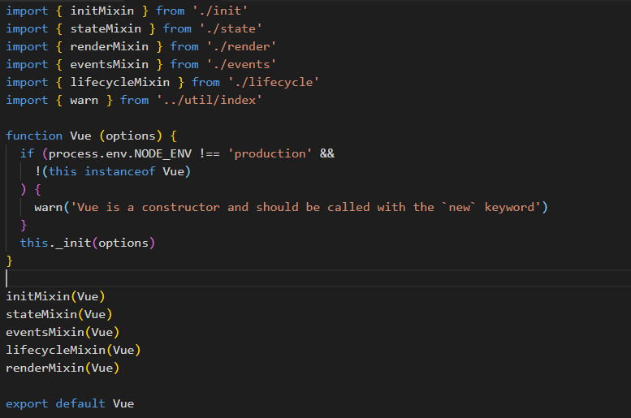
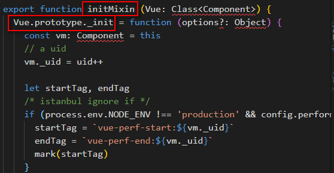
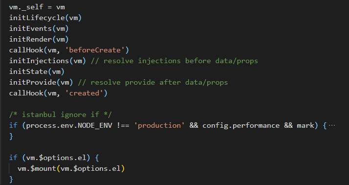
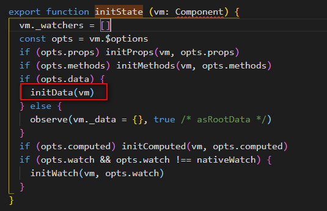
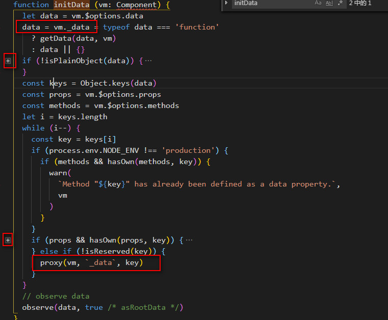
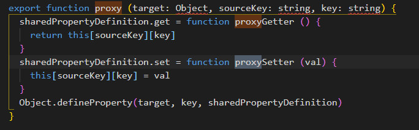

# new Vue()到底做了什么？
使用vue也有一段时间了，但是对于vue内部是如何实现的，还没看过它的实现对背后的很多原理并不是很理解，那么从这节课开始我们就从vue源码入手，学习下vue本身是如何实现的。

## 前言
本篇主要学习下new Vue()的时候都进行哪些操作，对整个new Vue()过程有个全面的认识和掌握，对于其中涉及到的具体方法不进行展开，因为一旦展开必定是方法套方法就会让整个分析的主线混乱，等后面具体的章节再进行展开学习。

## Vue
既然Vue是通过new调用的，那么它要么是ES5中的构造函数，要么是ES6中的类(class)，我们先看下vue的定义。

### Vue的定义

Vue是定义在src/core/instance/index.js中，我们Vue是声明的一个构造函数，创建vue实例时，首先判断如果不是'production'模式同时不是通过new的方式调用，那么就给出提示错误信息，随后调用_init方法进行初始化操作，_init方法其实是通过initMixin(Vue)方法定义在Vue原型上的。

### _init的定义
 1. initMixin方法定义在src/core/instance/init.js中，调用initMixin方法会给vue原型上定义一个_init方法。

 2. 执行_init方法，首先会对options进行一系列的判断处理，最后进行一系列初始化，生命周期、事件、Render函数、beforeCreate钩子、State等，最后调用$mount方法进行挂载。

### initState的定义
我们分析下为什么vue实例data中的属性，可以直接通过this.进行访问。
  1. 上面的实现主要是通过initState()方法实现的，initState方法定义在src/core/instance/state.js中，调用initState方法，会调用props、methods、data、computed、watch的初始化方法。

  

  2. 这块我们主要看下initData做了啥，为什么可以直接通过this[属性]就可以访问到？
initData方法中，首先通过vm.$options.data获取到data值，同时将data赋值给vm._data,然后获取data中所有的属性值，再接着判断在props和methods中是否已经定义了这些属性值，如果定义了给出错误提示，否则调用proxy(vm, '_data', key)方法。

  

  3. proxy方法中定义了属性的get/set方法，当我们使用this[属性]时，触发了定义的get方法，实际调用的便是get中定义的方法this['_data'][key]，这个就是为什么我们直接使用this[属性]便能访问到data中的值的原因。
  

## 总结
本篇我们主要分析了new Vue()的一个过程，同时分析了initData()的一个过程。Vue是定义的一个构造函数，通过new进行实例化的时候，会进行一系列的初始化，最后调用$mount进行挂载，下节学习vm挂载的过程。