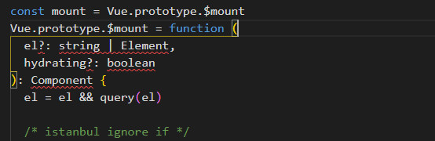
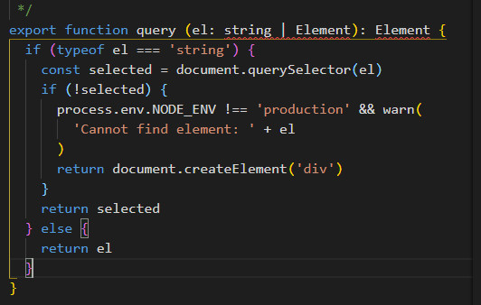
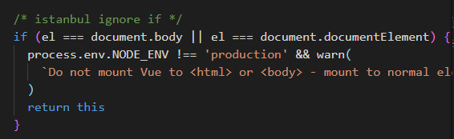
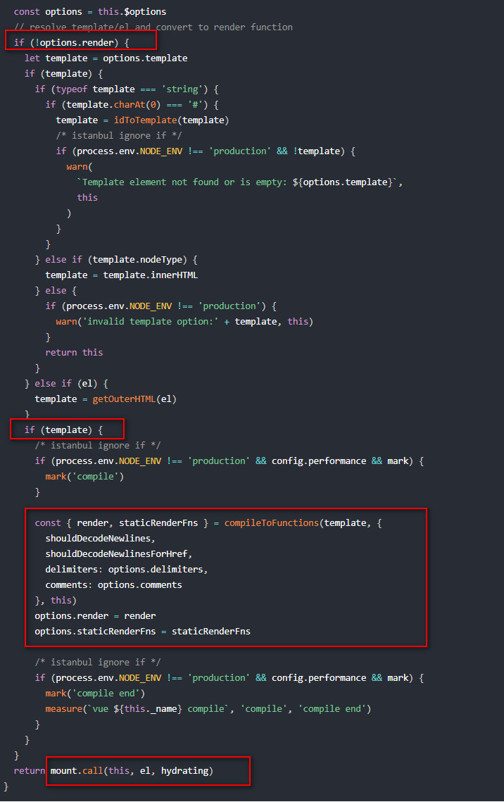
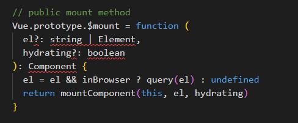
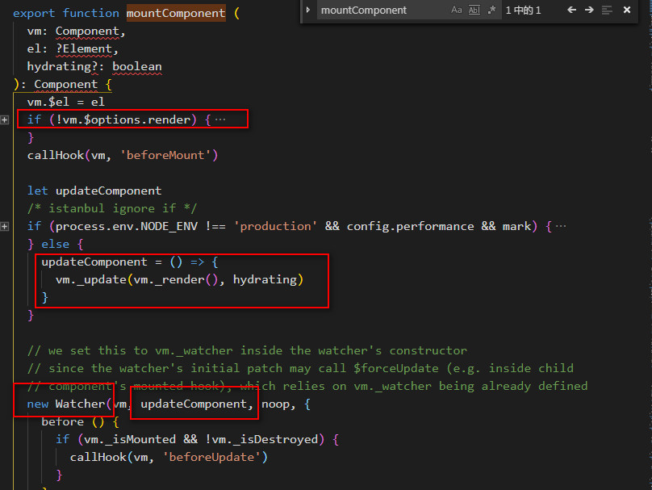
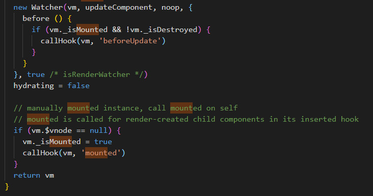
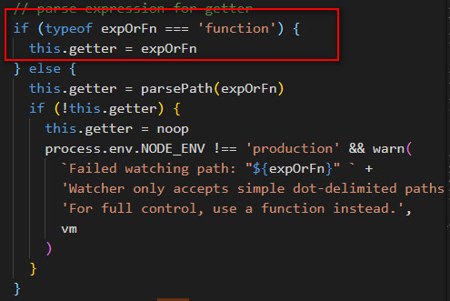
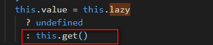
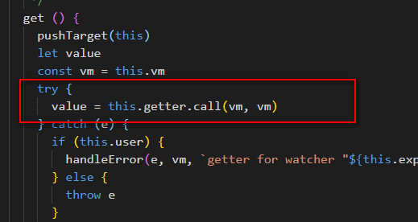

# vue挂载(mount)过程

## 前言
上篇分析了下new Vue()的过程，其中讲到new Vue()初始化完后会调用vm.$mount方法，对vue实例进行挂载，这篇继续学习vue实例的挂载。

## Vue的$mount定义
我看的是带有compiler编译的源码，入口文件是src/platforms/web/entry-runtime-with-compiler.js。
1. $mount调用的是src/platforms/web/entry-runtime-with-compiler.js文件中定义的$mount方法。代码中先将Vue原型上的$mount方法复制给mount变量，然后重新定义原型上的$mount方法，第一个产生书el表示挂载的元素，取值字符串/DOM元素，第二个参数hydrating是boolean值，与服务端渲染。

2. 调用query方法(src/platforms/web/util/index.js)对el进行判断和处理，如果传入了字符串query方法中通过document.querySelector()获取dom，如果获取不到dom，默认创建div，如果传入的是dom直接返回。

3. 对处理后的el进行判断，如果el是body或html元素，给出错误提示并返回。

4. 紧接着判断是否定义了render函数，如果没有定义，判断是否定义了template，如果没有正确的定义，会报错退出，如果定义了最后会调用compileToFunctions方法，将template转为render函数。

5. 最后调用缓存起来的mount方法，mount方法定义在
(src/platforms/web/runtime/index.js),首先对el进行判断，然后调用mountComponent方法。

6. mountComponent方法定义在(src/core/instance/lifeCycle.js),判断是否定义了render函数，如果没有定义render函数就会给出错误提示，否则定义一个updateComponent方法，最后执行new Watcher()实例化一个渲染watcher，updateComponent作为参数传入。最后判断为根节点的时候设置 vm._isMounted 为 true， 表示这个实例已经挂载了，同时执行 mounted 钩子函数。 这里注意 vm.$vnode 表示 Vue 实例的父虚拟 Node，所以它为 Null 则表示当前是根 Vue 的实例。

7. watcher类定义在(src/core/observer/watcher.js)中，上面的updateComponent方法作为一个参数传入，然后执行vm._watchers.push()进行依赖收集，判断传入的updateComponent是否是函数，如果是函数将其赋给this.getter，然后调用this.get()方法，get方法中会调用this.getter.call(vm, vm)，此时就相当于调用了传入的参数updateComponent方法。

**注意：**
  Watcher 有两个作用，一个是初始化的时候会执行回调，另一个是当 vm 实例中监测的数据发生变化时执行回调，这块儿在响应式原理部分学习。

8. 从第六步我们能看到，updateComponent方法中调用了vm.update(vm.render(), hydrating)方法，这里的vm.render()方法会生成VNode(虚拟Node)，最后调用vm.update()更新DOM。

## 总结
本篇我们主要学习new Vue()生成实例之后的$mount挂载过程，无论是否定义了render()函数，最终都会根据template或el转换成render()，最后再调用render()函数生成VNode，然后调用vm.update()更新DOM。关于vm.render()和vm.update()方法在下节继续学习。

